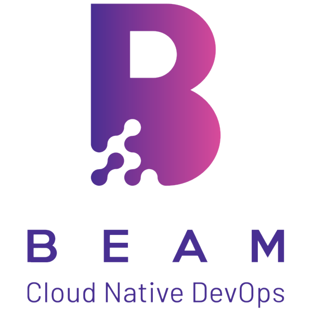
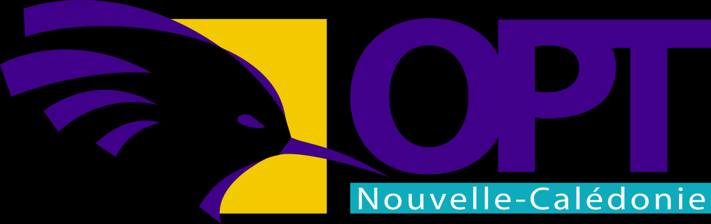

# Carvel Adopters

If you're using Carvel and want to add your organization to this
list, [follow these directions](#adding-your-organization-to-the-list-of-adopters)!

## Organizations using Carvel

(in alphabetical order)

## Solutions built with Carvel

(in alphabetical order)

Below is a list of solutions where Carvel is being used as a component.

**[BEAM](https://beam.lu/)**

BEAM is a consulting company based in Luxembourg and specialized in DevOps, Cloud and automation. BEAM supports their customers in their workload and delivery optimizations and helps them transition from traditional IT models to DevOps.

**[Office des Postes et Télécommunications de Nouvelle-Calédonie](https://www.opt.nc/)**

Office des Postes et Télécommunications de Nouvelle-Calédonie uses vendir to sync repos to build docker images, ytt to instanciate templates and are currently working on packaging services as applications with kapp. They are prototyping on an onPrem Tanzu instance. They are using Github.com and GH Actions to automate the whole thing and are evaluating Harbor vs. Artifactory vs. Github Container Registry to store/release their images.

**[Revng](https://rev.ng/)**

Revng is a small company with expertise in compilers, emulation and binary analysis. Revng uses ytt as a flexible templating tool to generate the configuration for [orchestra](https://github.com/revng/orchestra), their meta build system/package manager.

**[Tanzu Community Edition](https://tanzucommunityedition.io/)**

Tanzu Community Edition provides package management to users via the Tanzu CLI. Package management is defined as the discovery, installation, upgrading, and deletion of software that runs on Tanzu clusters. Each package is created using Carvel tools and following their packaging process.

**[TeraSky](https://terasky.com/)**

TeraSky is an Advanced Technology Solutions Provider. We utilize the carvel suite in order to streamline k8s configuration and deployment by many of our customers. We also utilize ytt to manage additional yaml based systems such as vRealize Automation and CloudFoundry.

**[VMware](https://www.vmware.com)**

VMware uses Carvel as their package management tooling for [their Kubernetes offerings](https://tanzu.vmware.com/products), such as [Tanzu Mission Control](https://tanzu.vmware.com/mission-control) (TMC) and [Tanzu Kubernetes Grid](https://tanzu.vmware.com/kubernetes-grid) (TKG). 

## Adding your organization to the list of adopters

If you are using Carvel and would like to be included in the list of Carvel Adopters, add an SVG version of your logo to the `logos` directory in this repo and submit a pull request with your change. Name the image file something that reflects your company (e.g., if your company is called Acme, name the image acme.svg). See [this PR](https://github.com/vmware-tanzu/carvel/pull/280) for an example.
