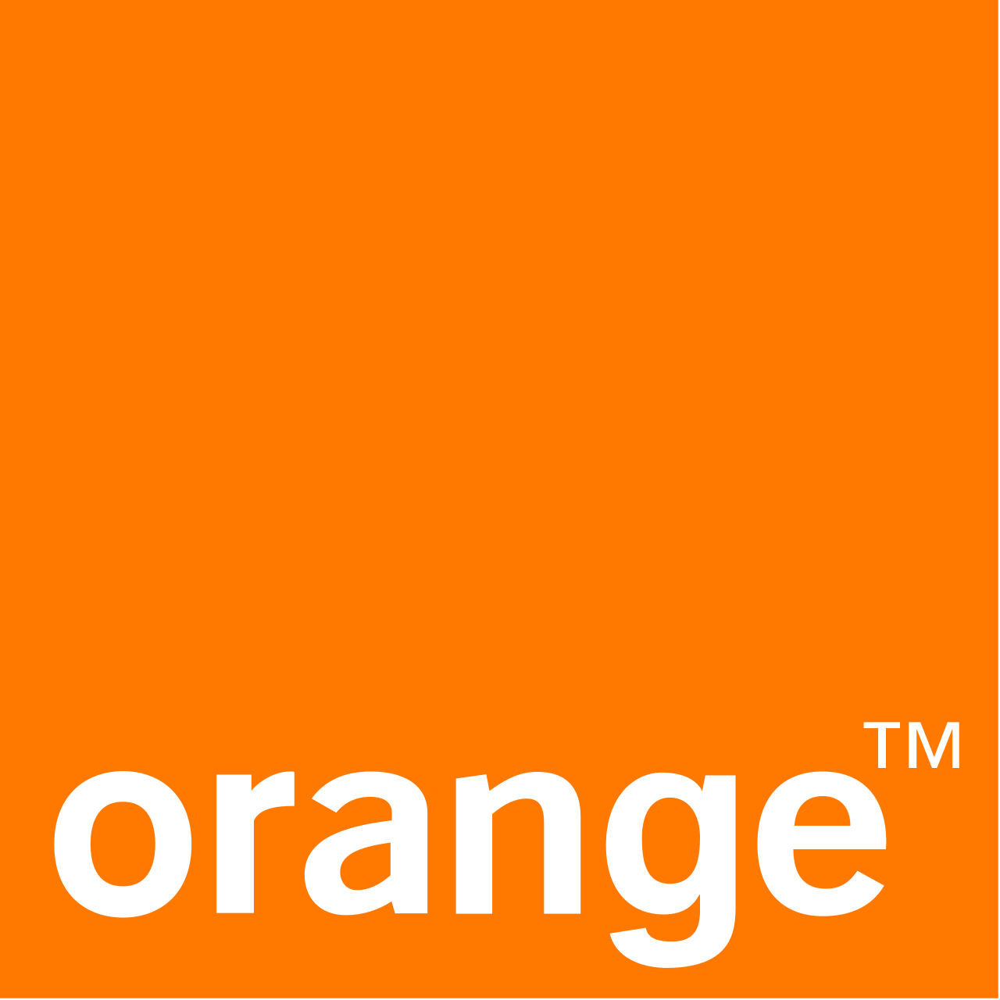
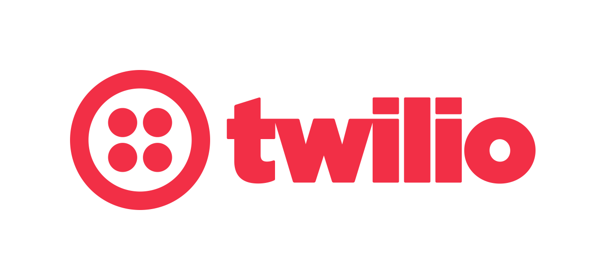

# Carvel Adopters

If you're using Carvel and want to add your organization to this
list, [follow these directions](#adding-your-organization-to-the-list-of-adopters)!

## Organizations using Carvel

 &nbsp; &nbsp; &nbsp;
 &nbsp; &nbsp; &nbsp;
 &nbsp; &nbsp; &nbsp;
&nbsp; &nbsp; &nbsp;
&nbsp; &nbsp; &nbsp;
&nbsp; &nbsp; &nbsp;
&nbsp; &nbsp; &nbsp;
&nbsp; &nbsp; &nbsp;
&nbsp; &nbsp; &nbsp;

## Solutions built with Carvel

(in alphabetical order)

Below is a list of solutions where Carvel is being used as a component.

**[BEAM](https://beam.lu/)**

BEAM is a consulting company based in Luxembourg and specialized in DevOps, Cloud and automation. BEAM supports their customers in their workload and delivery optimizations and helps them transition from traditional IT models to DevOps.

**[Fabrique Numérique des Ministères Sociaux](https://www.fabrique.social.gouv.fr/)**

Fabrique Numérique des Ministères Sociaux uses kapp CLI as deployer for their CI/CD tooling that they are developing and implementing actively: [Kontinuous](https://socialgouv.github.io/kontinuous/). The project started as a wrapper around Helm and Kapp, then evolved to offer more abstraction and a rich plugins system.

**[Office des Postes et Télécommunications de Nouvelle-Calédonie](https://www.opt.nc/)**

Office des Postes et Télécommunications de Nouvelle-Calédonie uses vendir to sync repos to build docker images, ytt to instanciate templates and are currently working on packaging services as applications with kapp. They are prototyping on an onPrem Tanzu instance. They are using Github.com and GH Actions to automate the whole thing and are evaluating Harbor vs. Artifactory vs. Github Container Registry to store/release their images.

**[Orange](https://www.orange.com/)**

Orange is currently running their application in testing, not yet product. Their scenario for using Carvel is crossplane CRD templating while preserving coding assistance (See: [XRD spec.versions[0].schema.openAPIV3Schema is weakly typed as an object instead of full openapi schema crossplane/crossplane#3197 (comment)](https://github.com/crossplane/crossplane/issues/3197#issuecomment-1194624402) and [Adapt ytt syntax to leverage K8S CR completion during authoring vfarcic/devops-toolkit-crossplane#4)](https://github.com/vfarcic/devops-toolkit-crossplane/issues/4)). They are also using Carvel for triggering/scheduling execution of kuttl kests within the K8s cluster.

**[Revng](https://rev.ng/)**

Revng is a small company with expertise in compilers, emulation and binary analysis. Revng uses ytt as a flexible templating tool to generate the configuration for [orchestra](https://github.com/revng/orchestra), their meta build system/package manager.

**[Spring Cloud Data Flow](https://dataflow.spring.io/)**

In their own words: The (Spring Cloud Data Flow)[https://dataflow.spring.io/] project is using Carvel. We have been running our k8s acceptance tests using Carvel for some time and are now preparing to make it the default packaging for the Pro version. The hope is that we can provide users of OSS and Pro version a deployment experience that is as simple as Helm but more powerful when needed. The acceptance tests need to run many permutations of tests. We deploy multiple k8s clusters, then deploy the databases and message brokers needed for the permutations that will run in that cluster. Then we run all permuations in parallel which means each instance in deployed in a separate namespace and it's own configuration.

**[TeraSky](https://terasky.com/)**

TeraSky is an Advanced Technology Solutions Provider. We utilize the carvel suite in order to streamline k8s configuration and deployment by many of our customers. We also utilize ytt to manage additional yaml based systems such as vRealize Automation and CloudFoundry.

**[Twilio](https://www.twilio.com)**

Today’s leading companies trust Twilio’s Customer Engagement Platform (CEP) to build direct, personalized relationships with their customers everywhere in the world. Twilio enables companies to use communications and data to add intelligence to every step of the customer journey, from sales to marketing to growth, customer service and many more engagement use cases in a flexible, programmatic way.

Twilio uses Carvel to package and deliver reliable, predictable, and consistent infrastructure across its fleet of Kubernetes clusters.

**[VMware](https://www.vmware.com)**

VMware uses Carvel as their package management tooling for [their Kubernetes offerings](https://tanzu.vmware.com/products), such as [Tanzu Mission Control](https://tanzu.vmware.com/mission-control) (TMC) and [Tanzu Kubernetes Grid](https://tanzu.vmware.com/kubernetes-grid) (TKG). 

## Adding your organization to the list of adopters

If you are using Carvel and would like to be included in the list of Carvel Adopters, add an SVG version of your logo to the `logos` directory in this repo and submit a pull request with your change. Name the image file something that reflects your company (e.g., if your company is called Acme, name the image acme.svg). See [this PR](https://github.com/vmware-tanzu/carvel/pull/280) for an example.
