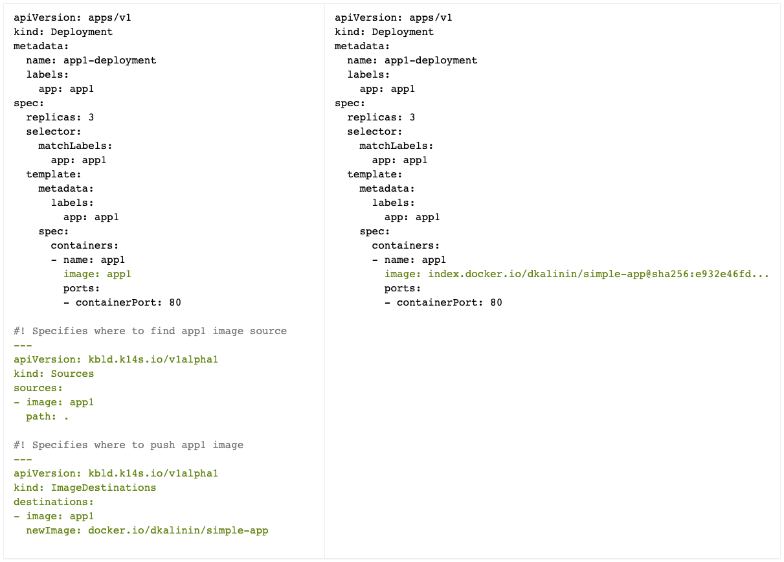

`kbld` (pronounced: `kei·bild`) seamlessly incorporates image building and image pushing into your development and deployment workflows.

Features:

- Orchestrates image builds (delegates to tools like Docker, pack, kubectl-buildkit) and registry pushes
- Works with local Docker daemon and remote registries, for development and production cases
- Records metadata about image sources in annotation on Kubernetes resources (see examples below)
- Resolves image references to their digest (immutable) form
- Provides a way to transport set of images in a single tarball between registries
  - maintaining exactly same digests, hence guaranteeing exactly same content
- Not specific to Kubernetes, but works really well with Kubernetes configuration files  

See [building and deploying simple Go application to Kubernetes example](https://github.com/vmware-tanzu/carvel-simple-app-on-kubernetes#step-3-building-container-images-locally) that uses kbld.

## Docs

- [Resolving image references to digests](resolving.md)
- [Building images from source](building.md)
- [Packaging/relocating images for distribution](packaging.md)
- [Registry authentication](auth.md)
- [Configuration](config.md)
- [CNAB image relocation mapping](cnab-image-relocation.md)
- Blog posts
  - [Introducing k14s (Kubernetes Tools): Simple and Composable Tools for Application Deployment](https://content.pivotal.io/blog/introducing-k14s-kubernetes-tools-simple-and-composable-tools-for-application-deployment)

### Misc

- [Development details](dev.md)
