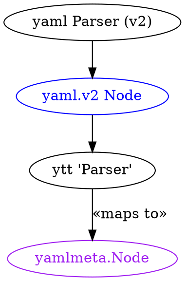
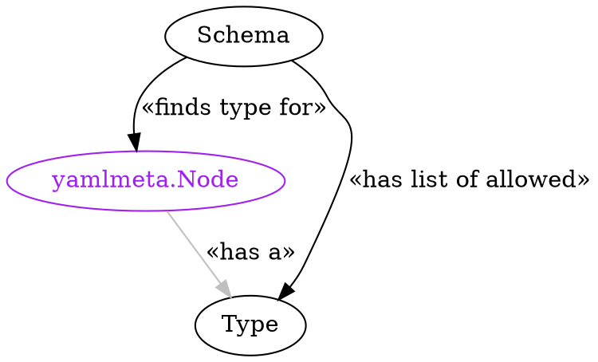
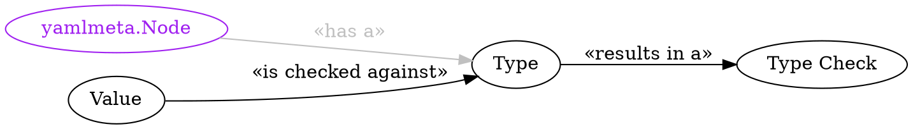

# Schemas

- Status: Scoping | **Pre-Alpha** | In Alpha | In Beta | GA | Rejected
- Originating Issue: [ytt#103](https://github.com/k14s/ytt/issues/103)
- Shared working copy: [](https://hackmd.io/pODV3wzbT56MbQTxbQOOKQ)


# Table of Contents

[TOC]

---

# Problem Statement

Configuration Authors want to be able to document, constrain, and generate configuration inputs (for example, Data Values) for _their_ users.

Specifically, they would like to:
- **have a single authoritative definition of possible inputs** (think: API) _to simplify the task of discovering the total set of possible inputs_;
- be able to **attach documentation to those definitions** in a format that tools could extract _to communicate meaning and intent of each input_;
- **provide structure/type checks and value validations** to inputs _so that errors can be detected quickly and reported in terms the user will likely understand_.

As of v0.26.0, `ytt` technically has a feature set that could satisfy all of these requirements. However, doing so is onerous and error prone. Also, many of the error messages that `ytt` emits today around these topics have been found by many users to be enigmatic (if not frustrating).

There exist tools that can meet some of these requirements. However, given the need to weave in many of these behaviors to the structure building algorithm that is `ytt`'s main flow, they fall short of meeting the first-order needs and do little to improve the user experience around specifying data values.

As an opportunistic driver, Configuration Authors who wrestle with non-trivial templatizing and patching of configuration would appreciate the ability to validate the resulting documents, helping ensure that their `ytt` library yields well-formed and valid YAML docs.

# Proposal

Implement a light-weight [type system](https://en.wikipedia.org/wiki/Type_system) for YAML documents: `ytt` Schema.

Focus first on addressing the needs around Data Values documents: making it easy to declare and activate a schema for this input.

This mechanism ought to:

- provide a way to articulate a schema for Data Values;
  - declare YAML document contents: Map, Array, their contained items by example (i.e. by simply adding the nodes)
- the schema must be YAML — itself — _so that users can leverage all that they learn/know about this format and not have to context switch to read/consider/write this description_;
- schema documents should enjoy all the features of data values files and templates _so that all of the attendant capabilities are available in this context as well_;
  - be able to define functions to capture expressions that are evaluated at runtime
  - be able to attach metadata (i.e. annotations) to capture information _outside_ of the structure of the document
- provide a means of attaching documentation to nodes;
- validate supplied Data Values against the schema, reporting violations in terms the end-user would understand.

Keep in mind that we aim for being able to articulate schema for any YAML document `ytt` handles. e.g. [ytt#103@schema-for-templates](https://github.com/k14s/ytt/issues/103#issuecomment-624326922)

## Sources of Inspiration

Be aware of prior art: avoid reinvention; shamelessly "repurpose" great ideas.

- [JSON Schema](https://json-schema.org/)
- [OpenAPI v3 schema](https://swagger.io/specification/) — _(see also [ytt#103@openapi](https://github.com/k14s/ytt/issues/103#issuecomment-672296576))_

Remember the differences in context:

- we seek simplicity, brevity, and readability.


# Specification
## Glossary

`ytt` bridges two type spaces: YAML and Starlark. Terms from both spaces are used in this specification

When referring to elements that are YAML, this specification uses terms defined in the [YAML 1.2 specification](https://yaml.org/spec/1.2/spec.html).

Commonly used terms:
- **document** — root node with a single value that can be a mapping, sequence, or scalar.
- **mapping** — a map (aka "dictionary") containing zero or more key/value pairs. Each value can be a mapping, sequence, or scalar.
- **node** - the composite of a YAML document; one of: a document, map, map item, array, array item, or scalar.
- **scalar** — single value type: boolean, float, integer, null, string.
- **sequence** — an array (aka "list") containing zero or more elements, in order.


Terms as they are meant in this specification:

- **schema** — (n.) a definition of the structure, types and validation rules for a given YAML document.
- **type** — (n.) a specific shape for a given node: a mapping, sequence, or scalar.
- **type checking** — (v.) comparing the shape of a YAML structure against its schema's types.
- **type check** — (n.) the result of type checking
- **validating** — (v.) determining whether the values contained in a YAML structure are acceptable.
- **validation** — (n.) the result of validating
- **validation rule** — predicate that indicates whether a given (sub-)structure is valid or not.
- **verifying** — (v.) a short-hand way of saying, "type checking and validation."
- **violation** — (n.) an instance of either a failed type check or a failed validation.

## Part 1: Declaring Schema

Configuration Authors establish a Schema by capturing the structure in a YAML document:

### @schema/definition

```yaml
#@schema/definition data_values=False
---
#! Schema contents
```
- `data_values` (`bool`) — whether this schema is applicable to data values. If this
  is not set to `True`, this results in an error.

Notes:
- Schema must be defined _before_ any other files containing YAML can be processed. Therefore, a file containing a Schema document must not contain other kinds of documents.
- files containing Schema documents will be detected among input files (i.e. those specified by `-f`).
- the first file containing a Schema document establishes the "base". Subsequent files containing Schema documents are overlayed onto the "base" in the order they appear (identically to how Data Values files are processed).

## Part 2: Applying Schema

The Configuration Author can currently apply schema to Data Values.

_(Review [previous versions of this proposal](https://github.com/k14s/design-docs/commit/abd6dba2dc4bf9e46c0f352d2f2ae7bf17d08ac6#diff-1b42631f7965920fdf750e6ae57eb93df771f053b684d338dc89b5d0eb215bc1R114-R142) including [commentary as to why those ideas were deferred](https://github.com/k14s/design-docs/pull/1#discussion_r520717953) for ideas to more broadly apply schema)_


**TODO:** elaborate on programmatic application of schema (e.g. to the contents of a ConfigMap)

## Part 3: Supported Types

While YAML provides for an extendable range of types, the `ytt` Schema supports a specific set.

### Scalar Types

- `bool` — `true`, `false` (and when not strict, `yes`, `no`, `Y`, `N`, etc.)
- `float` — e.g. `0.4`
- `int` — e.g. `42`
- `null` — `null`, `~`, and when value is omitted.
- `string` — e.g. `""`, `"ConfigMap"`, `"0xbeadcafe"`


### Algebraic Types

- `any` — any valid YAML value is permitted.
- `oneof<typeA, typeB, ...>` — value can be any one of the the specified types.

TBD:
- **Q:** given that there is no concrete type `any` (i.e. it represents the union of all types), should "any value" be
    - a named type: `any` or 
    - a condition: `#@schema/type any=True`
- **Q:** is there a need for an `anyof` type? (i.e. where a value if well-formed if it matches any subset of the union of the specified types) (for example [anyOf from Swagger docs](https://swagger.io/docs/specification/data-models/oneof-anyof-allof-not/#anyof-vs-oneof))


### Collection Types

A collection type is the pair of itself (either `map` or `array`) and its contained type.

#### Array type

`array<type>` — a YAML sequence, each item must be of the specified `type`.

Examples:
- `array<string>` — a sequence of strings (and only strings)
- `array<oneof <int, string>>` — a sequence containing any combination of integers and strings
- `array<map<...>>` — a sequence containing only map instances of the same shape.


#### Map type

`map <keyA:typeA, keyB:typeB, ...>` — a YAML mapping that must contain exactly one item of each given key, whose value must be of the type specified.

Examples:
- `map <"enable":bool, "static_ip":oneof<null,string>` — two items: one must have the key `enable` containing a boolean, the other must have the key `static_ip` and can be either a string or null.
- `map <"cpu":oneof<float,int,string>>` — key named `cpu` that can be set to a floating point value, and integer or a string.


## Part 4: Defining Schema (implicitly)

The schema definition spells out the set of nodes that must make up that kind of YAML document. Documents that are type checked and validated against the schema are guaranteed to be proper.

For example, in the case of Data Values, the schema guarantees to templates that all values exist and are of the correct type. The aleviates templates from doing existence and type checks, themselves.

### Inferring Types

Structure in Schema is largely expressed by example rather than by description. Types are — by default — inferred based on the values given. The Configuration Author can override these defaults using the [`@schema/type`](#schematype) annotation.

```yaml=
#@schema/definition name="data/values"
---
system_domain: ""

load_balancer:
  enable: true
  static_ip: ""

app_domains:
- ""

databases:
- name: ""
  adapter: postgresql
  host: ""
  port: 5432
  user: admin
  secretRef:
    name: ""
```

where:
- Data Values must consist of four top-level map items:
    - `system_domain` — whose value is a string,
    - `load_balancer` — whose value is a map containing two items:
        - `enable` — whose value is a boolean
        - `static_ip` — whose value is a string
    - `app_domains` — whose value is an array of strings (and only strings)
    - `databases` — whose values is an array of maps of a specific shape: six (6) items:
        - `name` — containing a string
        - `adapter` — containing a string
        - `host` — also holds a string
        - `port` — holds an integer
        - `user` — a string
        - `secretRef` — containing a map with one key:
            - `name` — containing a string

### Inferring Default Values

The exact values that the Configuration Author specifies in Schema are the defaults (with one natable exception — arrays — which are detailed below). This ensures that all nodes are initialized with values, ideally with reasonable defaults.

Configuration Consumers can enjoy specifying only those values which vary from the default, reducing risk of errors and generally making configuration easier to maintain.

#### Inferring Defaults for Scalars

When a scalar value is specified, it is simply the default.  From the example, above:

- `system_domain` is an empty string, by default.
- `load_balancer.enable` is true by default.
- `databases[].adapter` is `"postgres"`, by default.

#### Inferring Defaults for Mappings

The set of items of a map are its default: any item missing will be automatically inserted with _its_ defaults.

- if `load_balancer` is omitted from supplied Data Values, it is inserted:
    - `load_balancer.enabled` is `true`
    - `load_balancer.static_ip` is `""`
- if `load_balancer` is specified with only `static_ip`, `enabled` is `true`.

When the Configuration Consumer supplies an empty map (i.e. `{}`), all items are defaulted:

For example,

`load_balancer: {}`

is defaulted to:

```yaml
load_balancer:
  enable: true
  static_ip: ""
```

#### Inferring Defaults for Arrays

The default value for all arrays is an empty array. Arrays are the only type for which defaults are **not** inferred.

From the example, above,

- `app_domains`, if not otherwise specified is `[]`
- `databases`, if not otherwise specified is `[]`

This behavior can be overriden using the [`@schema/default`](#schemadefault) annotation.

When values for an array _are_ provided by the Configuration Consumer, each item is defaulted based on the type specified in the schema.

Focusing on just `databases`, if the Configuration Consumer supplies this Data Value:

```yaml=
#@data/values
---
databases:
- name: uaa
- name: capi
  host: capi-db.svc.cluster.local
  secretRef:
    name: capi-db-credentials
- {}
```

The resulting Data Values (i.e. that supplied to templates), would be:

```yaml=
databases:
- name: uaa
  adapter: postgresql
  host: ""
  port: 5432
  user: admin
  secretRef:
    name: ""
- name: capi
  adapter: postgresql
  host: capi-db.svc.cluster.local
  port: 5432
  user: admin
  secretRef:
    name: capi-db-credentials
- name: ""
  adapter: postgresql
  host: ""
  port: 5432
  user: admin
  secretRef:
    name: ""
```


## Part 5: Defining Schema (explicitly)

Configuration Authors may override inferred typing and defaults through annotations.

### @schema/type

Explicitly sets the type of the annotated node.

```yaml
@schema/type one_of=typeA [, typeB[, ...]] [or_inferred=True] any=True
```

- `one_of` (`array of string`) — 
    - `typeX` (`string`) — the name of the type that the value of the annotated node must be.
        - Accepted values are:
            - "bool"
            - "float"
            - "int"
            - "null"
            - "string"
        - [Algebraic Types](#Algebraic-Types) explains the meaning of `one_of` types.
- `or_inferred` (`bool`) — whether to include the type inferred from the value of the annotated node (default: `false`).
    - if `false` the type of the value is ignored
    - if `true` the type of the value is included in the set of possible types.
- `any` (`bool`) — whether or not any and all types are permitted on this node (and its children)
    - to avoid confusion, this keyword argument is mutually exclusive to all other arguments; if this argument is
      provided along with others, an error results.

Note:
- it is an error to specify a default value that does not match the specified type.
- a deliberate consequence is that upto one collection type can be specified (through the `or_inferred` keyword argument).
- requiring `one_of` to be a keyword argument (rather than a positional one) leaves room for other kinds of type
  combinations (e.g. not of, any of, all of).

__

_Example 1: Integer or String_

```yaml
#@schema/type one_of=["int", "string"]
percentage: 0
```

allows `percentage` to contain either an integer or string.

__

_Example 2: Nullable Collection_

```yaml
#@schema/type one_of="null" or_inferred=True
aws:
  access_key: ""
  secret_key: ""
```

allows `aws` to either be `null` or the pair of access and secret key values.

__

_Example 3: Type mismatch_

```yaml
#@schema/type one_of=["null", "string"]
aws:
  access_key: ""
  secret_key: ""
```

will produce an error: with `or_inferred` defaulted to `false`, the given values's type (i.e. `map<...>`) is not permitted.

__

### @schema/default

Explicitly sets the default value of the annotated node.

```yaml
@schema/default value
```

- `value` (any except `function`) — the overriding default value.

Notes:
- `value` must be of the type of the annotated node.
- The type of a node is never inferred from the overriding default value.
- this annotation is the _only_ way to set a non-empty default value for arrays.
    - Assumption: setting default values for arrays is uncommon.

TBD:
- in order to encourage readability of `ytt` schemas, we would like to limit use of this annotation only to cases where it is required. However, this gets complicated when the value can also be `null`. Cases where explicitly setting a default value is redundant include:
    - a scalar default on a node with a scalar value (that's not nullable)
    - a map whose items either contain scalars or maps of scalars.
    - `any`

__

_Example 1: Default values for arrays of scalars_

```yaml
#@schema/default ["apps.example.com", "services.example.com"]
app_domains:
- ""
```

__

_Example 2: Default values for arrays of maps_

```yaml=
#@def uaa_db():
name: uaa
host: uaa-db.svc.cluster.local
user: admin
#@end

#@def capi_db():
name: capi-embedded
user: admin
#@end

#@schema/default [uaa_db(), capi_db(), {"name": "null_db"}]
databases:
- name: ""
  adapter: postgresql
  host: ""
  port: 5432
  user: admin
  secretRef:
    name: ""
```

where
- `databases` is type-inferred as an array of maps of the shape shown from L14-20.
- there are three items by default: the `uaa`, `capi-embedded`, and `null_db`

__

_Example 3: Explicitly nullable_

```yaml
#@schema/type one_of="null", or_inferred=True
#@schema/default None
aws:
  access_key: ""
  secret_key: ""
```

where
- `aws` is typed as a nullable map; the inferred default value are the two items, `access_key` and `secret_key` both empty strings.
- in fact, the default of `aws` will be `null` (`None` is the Starlark keyword for `null`)

__

### @schema/nullable

Extends the type of the node to include "null" _and_ to be "null" by default.

```yaml
@schema/nullable
```

Notes:
- Assumption: it is common for the Configuration Author to wish to specify that no matter the type, a value is both nullable and null, by default.
- this annotation is equivalent to:
    ```
    #@schema/type "null", or_inferred=True
    #@schema/default None
    ```

_Example 1: Null string_

```yaml
#@schema/nullable
name: ""
```

where `name` can hold a string, but also be null. `name` is `null` by default.

__

_Example 2: Null map_

```yaml
#@schema/nullable
aws:
  username: ""
  password: ""
```

where `aws` is null by default. When set `aws` will be a map with the two items.

__

_Example 3: Nullable map_

```yaml
#@schema/nullable 
#@schema/default {}
cf_db:
  username: "sa"
  admin_password: ""
```

is equivalent to

```yaml
#@schema/type one_of="null", or_inferred=True
cf_db:
  username: "sa"
  admin_password: ""
```

and in both cases, `cf_db` is defaulted to the inlined value (`username`, the string `"sa"`, `admin_password`, an empty string). However, `cf_db` _can_ also be set to `null`.


### @schema/key

Defines criteria for values permitted for the key of the annotated node.

```
@schema/key [allowed=Regexp] [(expects=Int|String|List|Function | missing_ok=Bool)]
```

- `allowed=Regexp` — (optional) regular expression declaring the required format of the key.
  - if this argument is omitted, the key specified in the document must match that in the schema.
- `expects=Int|String|List|Function` — (optional) expected number of items to be `allowed`
  (and that are not matched by other schema).
   - `Int` — must match this number, exactly
   - `String` (e.g. `"1+"`) — must match _at least_ the number
   - `Function(found):Bool` — predicate of whether the expected number of key were found
      - `found` (`Int`) — number of actual matches
   - `List[Int|String|Function]` — must match one of the given criteria
   - Default: `1` (`Int`) (i.e. match exactly one (1) item)
- `missing_ok=Bool` — (optional) short-hand for `expects="0+"`

Notes:
- this annotation is only applicable to map items. If it is specified on any other kind of node,
  it is an error.
- only target map items that have not matched with prior schema map items are subject to matching
  via `allowed`. That is, map item matching occurs in the order that they appear in the schema.
- the re-use of `expects` from Overlays is deliberate: in both cases, the parameter captures
  how many of a given item are expected.

_Example 1: Required with any key_

To require a map item with unspecified key, containing an array of strings:

```yaml
connection_options:
  #@schema/key allowed="any"
  _: 
  - ""
```

__

_Example 2: Optional with any key_

To specify an optional map item with unspecified key, containing an array of strings:

```yaml
connection_options:
  #@schema/key allowed="any" expects=[0,1]
  _: 
  - ""
```

__

_Example 3: Any number of keys_

To specify any number of map items with unspecified keys, each containing an array of strings:

```yaml
connection_options:
  #@schema/key allowed="any" expects="1+"
  _: 
  - ""
```

__

_Example 4: Specific possible keys_

To specify a map item with a key of a specific set, containing an array of strings:

```yaml
connection_options:
  #@schema/key allowed=lambda key,_: key in ["aws", "gcp", "azure"]
  _: 
  - ""
```

__

_Example 5: Required suffix

To specify a map item whose key must have a specific suffix, each containing an array of strings:

```yaml
connection_options:
  #@schema/key allowed=lambda key, suffix: key.endswith(suffix)
  _db: 
  - ""
```

__

_Example 6: Optional key

To specify an optional map item. If present, must match the specified key and shape.

```yaml
connection_options:
  #@schema/key missing_ok=True
  bucket: 
    access_key: ""
    secret_key: ""
```


## Part 6: Documenting Schema

Configuration Authors may document individual items in a Schema to clarify their meaning, purpose, and impact.
They may also wish to decorate schema with descriptive information that can generate documentation or a User Interface
designed to ease configuration.

### @schema/title

Sets the user-friendly name or title of the node.

```yaml
@schema/title title
```

- `title` (`string`) — the short and human-readable name for the annotated node. This name should be suitable for 
  the name of a field in a UI or the "property name" column in a table in documentation (< ~20 characters)

Note:
- the default title for a map item is its key name where non-alphanumeric are replaced with spaces and the first letter is capitalized
  similar to [rails humanize functionality](https://apidock.com/rails/String/humanize).

_Example:_

```yaml
#@schema/title "Account Password"
password: ""
```

__


### @schema/doc

Sets the text describing the purpose of the node.

```yaml
@schema/doc documentation
```

- `documentation` (`string`) — a more thorough description of the node or section that shares the context
  of the node, enumerates the range of possible values, explaining the effects of certain value ranges.
  - often these strings include formatting typography (e.g. HTML or Markdown) to support display of these
    values in documentation settings.

_Example 1: Short description_

```yaml
#@schema/doc "The user password used to log in to the system"
user_password: ""
```

__

_Example 2: Multi-line description_

Take advantage of Starlark's multi-line string syntax to make a full description readable within the
schema document.

```yaml
#@ documentation = \
#@ ''' Optional configuration if using a private registry that has all cf-for-k8s images relocated to
#@     see <docs/platform_operators/system-registry.md>
#@ '''
#@schema/doc documentation
system_registry:
```

__

_Example 3: HTML-formatted description_

When the primary consumption of documentation will be in a formatted form, the Configuration Author
can use that format.

```yaml
#@ documentation = \
#@ '''<p><i>Optional</i> configuration if using a private registry that has all cf-for-k8s images relocated to
#@     see <a href="docs/platform_operators/system-registry.md">docs/platform_operators/system-registry.md</a>
#@ '''
#@schema/doc documentation
system_registry:
```


### @schema/example

Captures an exemplary value for the annotated node.

```yaml
@schema/example sample_value
```

- `sample_value` (_type matching the node_) — a sample value that illustrates a common use. The value must be of the
  effective type of the node; to specify a value of another type is an error.
- due to current limitations within `ytt`'s annotation system, only one example can be given: this annotation cannot
  be repeated. To supply multiple examples, use the [`@schema/examples`](#schemaexamples) annotation.

_Example:_

```yaml
#@schema/example "my_domain.example.com"
system_domain: ""
```

__


### @schema/examples

Captures multiple exemplary values for the annotated node.

```yaml
@schema/examples (exampleA_description, exampleA_value)[, (exampleB_description, exampleB_value)]
```

- `(exampleX_description, exampleX_value)` ([`tuple`](https://github.com/google/starlark-go/blob/master/doc/spec.md#tuples)) — 
  the example pair:
  - `exampleX_description` (`string`) — naming and describing the purpose or impact of the example value.
  - `exampleX_value` (_type matching the node_) — a sample value that illustrates a common use. The value must be of the
    effective type of the node; to specify a value of another type is an error.


_Example 1: Simple examples_

```yaml
#@schema/examples ("One domain across the foundation", ["apps.example.com"]), ("Multi-tenant foundation", ["pets.com", "nile.com"] )
apps_domain: []
```

__

_Example 2: Complex examples_

Illustrates how different databases require different amounts of configuration.

```yaml
#@ def postgres_example():
name: uaa
host: uaa-db.svc.cluster.local
user: postgres
secretRef:
  name: uaa-db-creds
#@ end

#@ def mysql_example():
name: uaa
adapter: mysql
host: uaa-db.svc.cluster.local
port: 3306
user: root
secretRef:
  name: uaa-db-creds
#@ end

#@schema/examples ("Postgres", postgres_example()), ("MySQL", mysql_example())
databases: []
```


### @schema/deprecated

Marks a node as targeted for removal while still remaining defined and used.

```yaml
@schema/deprecated notice
```

- `notice` (`string`) — a message elaborating on the reason for the deprication, how to prepare for
  the removal (e.g. migrate to using a newly introduced value), and possibly a version-based timeline
  for when the removal will happen.

Notes:
- when a value is specified for the node outside of the schema, a standardized warning that includes
  `notice` will be output to standard error, and evaluation continues.

_Example:_

```yaml
load_balancer:
  #@schema/deprecated "Will be removed in 2.0.0; in that version, specify `null` for `load_balancer` to disable."
  enable: true
  static_ip: ""
```

__

### @schema/removed

```yaml
@schema/removed remedy
```

- `remedy` (`string`) — a message providing next step instructions on how to repair the document/configuration.

Notes:
- when a value is specified for the node outside of the schema, a standardized warning that includes
  `remedy` will be output to standard error, and evaluation stops.

_Example:_

```yaml
load_balancer:
  #@schema/removed "Was removed as of 2.0.0; specify `null` for `load_balancer` to disable."
  enable: true
  static_ip: ""
```


## Part 7: Validating Documents

Beyond specifying a type for a value, one can specify more dynamic constraints on the value via validations.

### @schema/validate

```yaml
@schema/validate [...user-provided-funcs,] [...builtin-kwargs]
```

  This annotation specifies how to validate value. `@schema/validate` will provide a set of keyword arguments which map to built-in validations, such as `max`, `max_len`, etc., but will also accept user-defined validation functions. Less common validators will also be provided via a `validations` library. For example,

  ```yaml
  #@ def number_is_even(num): return (num % 2 == 0, "Number is not even")

  #@schema/validate number_is_even, min=2
  replicas: 6
  ```

  will use the `min` predefined validator as well as the user-provided `number_is_even` function for validations. Function arguments should have a signature which matches the signature of custom functions passed to [`@overlay/assert`](https://github.com/k14s/ytt/blob/develop/docs/lang-ref-ytt-overlay.md).

  Full list of builtin validations exposed via kwargs (all have 2nd form: a tuple of value and error message):

  - min=int
  - max=int
  - min_len=int
  - max_len=int
  - enum=[string|int|...]: any set of values
  - regexp=string (TBD or pattern?) -> golang regexp
  - format=string (mostly copied from JSON Schema)
    - date-time: Date and time together, for example, 2018-11-13T20:20:39+00:00.
    - time: New in draft 7 Time, for example, 20:20:39+00:00
    - date: New in draft 7 Date, for example, 2018-11-13.
    - email: Internet email address, see RFC 5322, section 3.4.1.
    - hostname: Internet host name, see RFC 1034, section 3.1.
    - ip: IPv4 or IPv6
    - ipv4: IPv4 address, according to dotted-quad ABNF syntax as defined in RFC 2673, section 3.2.
    - ipv6: IPv6 address, as defined in RFC 2373, section 2.2.
    - uri: A universal resource identifier (URI), according to RFC3986.
    - port: >= 0 && <= 65535
    - percent: k8s's IsValidPercent e.g. "10%"
    - duration: Golang's duration e.g. "10h"
  - not_null=bool to verify value is not null
  - unique=bool to verify value contains unique elements (TBD?)
  - starts_with=string to verify string has prefix
  - ends_with=string to verify string has suffix
  - TBD

  Full list of builtin validations included in a library:

  - ...kwargs validations as functions...
  - base64.decodable()
  - json.decodable()
  - yaml.decodable()
  - regexp.is_valid()

  String values, by default, have `@schema/validate min_len=1` validation added.

#### Validation Documentation

Configuration Consumers are more likely to provide valid values if they are aware
of what defines valid.

For this reason, validations should provide user-friendly documentation that makes
this clear:
- concise phrase that describes a valid value;
- a short list of common example valid values;
- citation to canonical definition.

TBD.

Sketch:
- invoke the validation function with no arguments
  - if it returns a `string` that is documentation (including the name)
  - if it returns an error, discard and replace with default documentation (e.g. "Validation: "+str(validation_func))
- first class `ytt` Schema functions can include this behavior
- 3rd party functions can be wrapped in a function (or lambda expression) to decorate this behavior:
    ```python
    def is_valid_ip(val="__yttdoc__"):
      if val != "__yttdoc__":
        return thirdPartyLib.valid_ip(val)
      else:
        return "Valid IP: a well-formed IPv4 (RFC 2673, section 3.2) or IPv6 address (RFC 2373, section 2.2)."
    end
    ```

**Implementation considerations:**


As part of the implementation of the validation feature we should use some of the knowledge from the Type Checking
implemented before.
- Isolation of packages like yamlmeta from external dependencies

    This package is intended as a place for the yaml internal structures
- Eventually it make sense to implement the validation near the Schemas and also move the Type Check to the same package

    When implementing we should consider to create a walker that iterate over the YAML document to do the Check or the Validation depending on the action we want to perform in a given moment
    
## Part 8: Command-Line Interface Interactions

:::warning
There is active User Research into how to more effectively communicate with `ytt` users. Findings from that research
should trump whatever "requirements" are specified below.
:::

Schema violation messages should be:
- readable — easy/quick to determine the nature and details of the violation.
- actionable — clear what step would need to be taken to fix the violation.
- complete — no other context is required to fix the violation.
- supportive — informs, without blame.

To get there, consider these principles:
- convey concisely — the fewer words written, the more words read.
- be consistent — use the same word for the same concept; the same layout for the same kind of message.
- prioritize position of information — place more important information in a more prominent spot.
- be empathetic — use words the user must already know; when you cannot, define it or point to a definition.

### Type Violations

When a value given is malformed (wrong structure/type) `ytt` will report these violations and stop processing.

Type violations can come from:
- an incorrectly formed explicit default value (i.e. the value of `@schema/default`)
- a data value (noted below: all `@data/values` documents are implied overlays)

`schema.yml`
```yaml=
#@schema/definition name="data/values"
---
system_domain: ""

load_balancer:
  enabled: true
  external_ip: ""
```

`values.yml`
```yaml=
#@data/values
---
system_domain: false
load_balancer: true
```

```
$ ytt -f schema.yml -f values.yml
ytt: Error: ...

Result of values.yml did not pass "data/values" schema:

values.yml:3 | system_domain:
             |     ^^^ found: boolean
             |         expected: string (by schema.yml:3)
```

**Note:**
- the document at `values.yml:2` implies `@overlay/match by=overlay.all` and `@overlay/match-child-defaults missing_ok=True`
- `values.yml` has two overlay operations: merge of `system_domain` and merge of `load_balancer`.
- there are, in fact, two type violations. However, `ytt` stops after the first overlay operation fails.

### Validation Violations

## Part 9: Interactions with Existing Features

### Changes to Data Values


#### Data Value Overlays Become More Permissive

Prior to Schemas, Data Values protected against mistakes like typo'ed key names through the strict merge of additional data values documents: to successfully merge a new key, it must be marked as `@overlay/match missing_ok=True`.

The responsibility to ensure key names are valid are shifted from Data Values to Schema.

When schema is present, Data Values documents imply an automatic merge of new keys. This is equivalent to all `@data/values` documents being annotated with `@overlay/match-child-defaults missing_ok=True`.

This behavior should not result in an error if a Data Values document _already_ is annotated this way.


#### All Data Values Become Overlays

Before Schema, the first YAML document annotated with `@data/values` effectively defined both an implied schema and defaults.

With Schema, the base data values document is produced by collecting all the net default values from the schema, itself.

`ytt` will automatically convert _all_ data values into overlays.


### Overlays

Schema aims to provide the earliest possible and actionable feedback so that Configuration Consumers can successfully complete their task in the shortest possible duration.

When one or more schema violation(s) occur after a Data Value overlay operation, `ytt` should:
1. display the current state of the violating portion of the document; (it's quite possible, this data does not appear anywhere else)
2. report the violation(s); and
3. stop processing.


### Overlays of Schema

TBD

- It must be possible to extend Schema (i.e. add new items)
- When do Configuration Consumers need to modify Schema?
    - they add templates that require additional data values
    - soften or remove overzealous validations
    - when overlays on templates change the type of the expected data values

## Open Questions

- Given that Data Values all become overlays, now all array items require a `@overlay/append`
    - this will be a negative UX for brand new users as it lights a number of tool features just so that I can specify an array for my library. :(
    - this has been a pain 
- How could we assign line numbers to YAML nodes that are generated from Starlark code? 
    - how common of a situation is this?
    - becomes more important when referencing nodes in schema because our violation messages depend on naming the type/structure declaration by line number.
- Overlaying Schema implies the need for meta to be copied along 
- Documentation could be enhanced if validation rules were included. How could validation authors provide documentation for their validation?
  - provide a magic string for the input and the function returns documentation?
  - function always returns documentation as part of return value?
- How should schema work with ytt libraries?
  - How do we support data values that are targeting a dependency library?
- How will code defined in a schema file make its way into the execution context of the target "template"?
  - e.g. function supporting validation
  - idea: could we capture the "globals" resulting from the execution of the schema "template" and feed those into the target "template"'s execution context?
  - there are expressions/statements to consume during the schema "template" construction... but other expression/statements that need to be made available to target "templates".
- Should we support generating `ytt` Schema from other popular sources (e.g. JSON Schema, OpenAPI v3 schema)?
- how to add more things to schema? (via overlays similar to data values)
- provide programmatic schema.apply() (similar to overlay.apply)
- respect schema for data values set via cmd line flags/env vars
- add --data-values-schema-inspect (similar to --data-values-inspect)
- a component team introduces breaking change… how do we discover that happened? (is that a use case that's in scope for ytt?)
- schema diff
    - as a Configuration Consumer, what drives me asking for a diff? what am I looking for?
    - what do we get from YAML diffing tools?
    - what is the gap between the need and what we get with diffing tools?
- using extensions for ytt types.
  - https://github.com/k14s/ytt/issues/51


# Sample Usage

Vetting of User eXperience by way of examples.

## Common Use Cases

Expectedly common situations that invoke more than one feature, illustrating proper interactions.

### Mutually Exclusive Map Configuration

## Edge Cases

Situations that stretch the capabilities of the feature set.

### Prometheus Label Set Rewriting

Prometheus includes a feature allowing operators to articulate label rewritting rules for metrics.
This feature is used throughout Prometheus' configuration. It is centered around a structure
known as a "relabeling".

Defining edits that operate on runtime text is frought with errors.
- a minor typo of a keyword,
- a regular expression that fails only in certain cases, or
- a sometimes required configuration being omitted

This example illustrates how Schema would enhance the Prometheus User's configuration experience.

Sources:
- https://github.com/prometheus-community/helm-charts/blob/451448b53/charts/kube-prometheus-stack/values.yaml
- https://prometheus.io/docs/prometheus/latest/configuration/configuration/#relabel_config

```yaml=
#! ==- Relabel Config -==
#!

#@ def replace_has_target_label(relabel):
#@   if relabel.action == "replace" and "targetLabel" not in relabel:
#@     return (False, "'targetLabel' not found on replace relabel rule")
#@   end
#@ end

#@ def non_hashmod_has_regex(relabel):
#@   if relabel.action in ["replace", "keep", "drop", "labelmap", "labeldrop", "labelkeep"] and \
#@      "regex" not in relabel:
#@     return (False, "'regex' not found on {} relabel rule".format(relabel.action))
#@   end
#@ end

#! As of Prometheus 2.22, there are 200+ meta labels
#@ known_meta_labels = {
#@   "__meta_azure_machine_id": True,
#@   "__meta_azure_machine_location": True,
#@   "__meta_azure_machine_name": True,
#@   "__meta_azure_machine_os_type": True,
#@   "__meta_azure_machine_private_ip": True,
#!   ... and many more
#@ }
#@ def known_meta_label(label):
#@   if label.startswith("__meta_"):
#@     if known_meta_labels[label] == None:
#@       return (False,
#@               "{} is not a known meta label (did you mean {}?)"\
#@                 .format(label, spelling.nearest(label, known_meta_labels.keys())))
#@     end
#@   end
#@ end

---
#@ def relabeling():
  #@schema/title "Source labels"
  #@ doc = '''
  #@   The source labels select values from existing labels. Their content is concatenated
  #@   using the configured separator and matched against the configured regular expression
  #@   for the replace, keep, and drop actions.
  #@ '''
  #@schema/doc doc
  sourceLabels:
  #@schema/validate known_meta_label, regexp=("[a-zA-Z_][a-zA-Z0-9_]*", "letters and numbers, starting with a letter")
  - ""
  
  #@schema/title "Source Label Separator"
  #@schema/doc "Separator placed between concatenated source label values."
  separator: ;
  
  #@schema/title "Target Label"
  #@ doc = '''
  #@   Label to which the resulting value is written in a replace action.
  #@   It is mandatory for replace actions. Regex capture groups are available.
  #@ '''
  #@schema/doc
  #@schema/key missing_ok=True
  #@schema/validate regexp=("[a-zA-Z_][a-zA-Z0-9_]*", "letters and numbers, starting with a letter")
  targetLabel: ""
  
  #@schema/title "Extraction regex"
  #@schema/doc "Regular expression against which the extracted value is matched."
  #@schema/key missing_ok=True
  #@schema/validate regexp.is_valid
  regex: ^(.*)$
  
  #@schema.title ""
  #@schema/key missing_ok=True
  modulus: 0
  
  replacement: $1
  
  #@schema/validate enum=["replace", "keep", "drop", "hashmod", "labelmap", "labeldrop", "labelkeep"]
  action: replace
#@ end

#@ def relabelings():
#@schema/validate replace_has_target_label, non_hashmod_has_regex
- #@ relabeling()
#@ end

#! metrics_path is required to match upstream rules and charts
#@ def metrics_path_relabel():
sourceLabels: [__metrics_path__]
targetLabel: metrics_path
#@ end

---
kubelet:
  serviceMonitor:
    
    #@schema/title "Scrape interval"
    #@schema/doc "If not set, the Prometheus default scrape interval is used."
    #@schema/validate format="duration"
    #@schema/key missing_ok=True
    interval: ""
       
    #@schema/doc "relabel configs to apply to cAdvisor metric samples before ingestion."
    cAdvisorMetricRelabelings: #@ relabelings()
    
    #@schema/doc "relabel configs to apply to probe metric samples before ingestion."
    probesMetricRelabelings: #@ relabelings()
    
    #@schema/doc "relabel configs to apply to cAdvisor samples before ingestion."
    #@schema/default [metrics_path_relabel()]
    cAdvisorRelabelings: #@ relabelings()

    #@schema/doc "relabel configs to apply to probe samples before ingestion."
    #@schema/default [metrics_path_relabel()]
    probesRelabelings: #@ relabelings()

    #@schema/doc "relabel configs to apply to resource samples before ingestion."
    #@schema/default [metrics_path_relabel()]
    resourceRelabelings: #@ relabelings()
    
    #@schema/doc "relabel configs to apply to metric samples before ingestion."
    metricRelabelings: #@ relabelings()
    
    #@schema/doc "relabel configs to apply to samples before ingestion."
    #@schema/default [metrics_path_relabel()]
    relabelings: #@ relabelings()
```

Pros:
- demonstrates the leverage functions bring: to extract the concept of a "relabeling", attach defaults and validations,
  and use widely.
- trickier configuration (e.g. regular expressions, exact meta label names, string formats) are not just caught earlier,
  but with context for more actionable error messages.
- ...

Cons:
- validation rules across the map + the map is an array item ==> the definition of "relabeling" had to be extracted and scoped to a separate document.
- ...


## Migration of Existing Configuration
### Cloud Foundry for Kubernetes

Cloud Foundry for Kubernetes — at the time of writing — is the most sophisticated use of `ytt` known.
In the absence of the Schema feature specified in this document, the CF for K8s project has written
their own custom validation logic.

With `ytt` Schemas, _all_ existing validation logic ought to be absorbed into the schema definition.

Specifically:
- "required" parameters : all string values imply a `@schema/validate min_len=1` by default
- a "non empty array" is `@schema/validate min_len=1`
- _(others ?)_

```yaml=
#@schema/definition name="data/values"
---
#@schema/doc "your system domain"
#@schema/example "system.cf.example.com"
#@schema/validate format="hostname"
system_domain: ""

#@schema/title "Application Domains"
#@schema/example ["apps.cf.example.com"]
#@schema/validate min_len=1
app_domains:
- 
  #@schema/validate format="hostname"
  ""

#@schema/title "Application Log Distinations"
app_log_destinations: []

#@schema/title "Cloud Foundry Administrator Password"
#@schema/doc "password for admin user (in plain text)"
cf_admin_password:

load_balancer:
  enable: true
  #@schema/title "Load Balancer Static IP"
  #@schema/doc "Reserved static IP for Load Balancer"
  #@schema/validation format="ip"
  static_ip: ""

system_certificate:
  #@schema/title "System Certificate"
  #@ doc = '''\
  #@   Certificate for the wildcard subdomain of the system domain.
  #@   For example, CN=*.system.cf.example.com
  #@ '''
  #@schema/doc doc
  #@schema/validate base64.decodable
  crt: ""
  #@schema/title "Private Key"
  #@schema/doc "Private key for the system certificate"
  #@schema/validate base64.decodable
  key: ""
  #@schema/title "CA Certificate"
  #@schema/doc "CA certificate used to sign the system certificate"
  #@schema/validate base64.decodable
  ca: ""

workloads_certificate:
  #@schema/title "Applications Certificate"
  #@ doc = '''\
  #@   Certificate for the wildcard subdomain of the applications domain.
  #@   For example, CN=*.apps.cf.example.co
  #@ '''
  #@schema/doc doc
  #@schema/validate base64.decodable
  crt: ""
  #@schema/title "Private Key"
  #@schema/doc "Private key for the applications certificate"
  #@schema/validate base64.decodable
  key: ""
  #@schema/title "CA Certificate"
  #@schema/doc "CA certificate used to sign the applications certificate"
  #@schema/validate base64.decodable
  ca: ""
 
gateway:
  #@schema/doc "When true, automatically upgrades incoming HTTP connections to HTTPS"
  https_only: true

capi:
  #@schema/title "CAPI DB"
  #@schema/doc "Database for Cloud API"
  database:
    #@schema/validation enum=["postgres", "mysql2"]
    adapter: postgres
    encryption_key: ""
    host: "cf-db-postgresql.cf-db.svc.cluster.local"
    #@schema/examples [("Postgres", 5432), ("MySQL", 3306)]
    port: 5432
    user: cloud_controller
    #@schema/doc "DB user password in plain text"
    password: ""
    name: cloud_controller
    #@schema/doc "Plain text ca certificate if tls should be used"
    ca_cert: ""
  log_level: info

uaa:
  #@schema/title "UAA DB"
  #@schema/doc "Database for User Authentication and Authorization service"
  database:
    #@schema/validation enum=["postgres", "mysql2"]
    adapter: postgres
    encryption_key: ""
    host: "cf-db-postgresql.cf-db.svc.cluster.local"
    #@schema/examples [("Postgres", 5432), ("MySQL", 3306)]
    port: 5432
    user: uaa
    #@schema/doc "DB user password in plain text"
    password: ""
    name: uaa
    #@schema/doc "Plain text ca certificate if tls should be used"
    ca_cert: ""

app_registry:
  #@schema/validate format="hostname"
  hostname: ""
  repository_prefix: ""
  username: ""
  password: ""

remove_resource_requirements: false
add_metrics_server_components: false
allow_prometheus_metrics_access: false
use_external_dns_for_wildcard: false
enable_automount_service_account_token: false
metrics_server_prefer_internal_kubelet_address: false
use_first_party_jwt_tokens: false

#@schema/title "CF Blobstore"
#@schema/doc "configuration for the blobstore holding buildpacks, droplets, packages, etc."
blobstore:
  endpoint: "http://cf-blobstore-minio.cf-blobstore.svc.cluster.local:9000"
  region: "''"
  access_key_id: "admin"
  secret_access_key: ""
  package_directory_key: "cc-packages"
  droplet_directory_key: "cc-droplets"
  resource_directory_key: "cc-resources"
  buildpack_directory_key: "cc-buildpacks"
  aws_signature_version: "2"

#@ doc = '''\
#@   optional configuration if using a private registry that has all cf-for-k8s images relocated to
#@   see <docs/platform_operators/system-registry.md>
#@ '''
#@schema/doc doc
system_registry:
  add_image_pull_secrets: false
  hostname: ""
  username: ""
  password: ""
```

### Minio

Partial minio config (based on https://github.com/helm/charts/blob/21e2e1b1f2656c785ece0ec741b047b21539d7b1/stable/minio/values.yaml#L244), shows how to have one-of available options.

```yaml
#@ load("@ytt:json", "json")

#@schema/definition name="data/values"
---
#@schema/validate lambda g: (g.s3 or g.azure or g.gcs or g.oss, "Must specify one gateway: s3, azure, gcs, oss")
gateway:
  #@schema/nullable
  s3:
    #@schema/validate min=1
    replicas: 4
    #@schema/validate prefix="https://"
    serviceEndpoint: ""
    accessKey: ""
    secretKey: ""

  #@schema/doc "Use minio as an azure blob gateway, you should disable data persistence so no volume claim are created. https://docs.minio.io/docs/minio-gateway-for-azure"
  #@schema/nullable
  azure:
    #@schema/doc "Number of parallel instances"
    #@schema/validate min=1
    replicas: 4

  #@schema/doc "Use minio as GCS (Google Cloud Storage) gateway, you should disable data persistence so no volume claim are created. https://docs.minio.io/docs/minio-gateway-for-gcs"
  #@schema/nullable
  gcs:
    #@schema/doc "Number of parallel instances"
    #@schema/validate min=1
    replicas: 4
    #@schema/doc "credential json file of service account key"
    #@schema/validate lambda val: (json.decodable(val), "key must be valid JSON")
    gcsKeyJson: ""
    #@schema/doc "Google cloud project-id"
    projectId: ""

  #@schema/nullable
  oss:
    #@schema/doc "Number of parallel instances"
    #@schema/validate min=1
    replicas: 4
    #@schema/validate prefix="https://"
    endpointURL: ""
```


### Dex

TODO: review and inline [Dex](example-partial-dex.yaml).


## Complex Examples

This snippet will result in an array with a single element, type `bucket`, with `versioning` defaulted to `Enabled`.

```yaml
#@ def default_bucket():
versioning: "Enabled"
#@ end

#@schema/default [default_bucket()]
bucket:
- name: ""
  versioning: ""
  access: ""
```


Array examples:

```yaml
service:
  #@schema/doc "List of IP addresses at which the Prometheus server service is available. Ref: https://kubernetes.io/docs/user-guide/services/#external-ips"
  externalIPs:
  #@schema/validate format="ip"
  - ""

imagePullSecrets:
- name: ""

ingress:
  #@schema/default ["chart-example.local"]
  hosts:
  - ""
 
  tls:
  - secretName: ""
    #@schema/validate min=1
    hosts:
    - ""

tolerations:
#@schema/type "any"
- null

#@schema/doc "Create multiple buckets after minio install. Enabling `defaultBucket` will take priority over this list"
#@schema/example [{"name": "bucket1"}]
buckets:
- name: ""
  #@schema/validate enum=["none"]
  policy: none
  purge: false
```

map[string]string examples:

```yaml
#@ def validate_map_str_to_str(vals):
#@   type(vals) == "dict" or assert.fail("Expected key to be map")
#@   for key in vals:
#@     type(key) == "string" or assert.fail("Expected key to be string")
#@     type(vals[key]) == "string" or assert.fail("Expected val to be string")
#@   end
#@ end

#@schema/type "any"
#@schema/validate validate_map_str_to_str
#@schema/example {"prometheus.io/scrape": "true", "prometheus.io/path": "/minio/prometheus/metrics", "prometheus.io/port": "9000"}
annotations: {}

#! ...

#@schema/example {"prometheus.io/scrape": "true", "prometheus.io/path": "/minio/prometheus/metrics", "prometheus.io/port": "9000"}
annotations:
  #@schema/any-key
  _: ""
```

Type any with default (TBD, should we force schema/default?):

```yaml
#@schema/type "any"
annotations:
  foo: bar
  blah: 123
```

Example of additional free-form properties:

```yaml
annotations:
  #@schema/any-key
  _: ""

db_opts:
  username: ""
  password: ""
  #@schema/any-key
  _:
    #@schema/type "any"
    value:
```

#### Asserting on higher level structure with optional lower key with #@schema/key-may-be-present

```yaml
#@schema
---
foo: ""

#@data/values
---
foo: "val"

config.yml:
---
foo: #@ data.values.foo #! never errors with: no member 'foo' on data.values
```

```yaml
#@schema
---
#@schema/key missing_ok=True
foo:

#@data/values
---
foo: "val"

config.yml:
---
foo: #@ yaml.encode(data.values) #! => {}, {"foo": "val"}
```

```yaml
#@schema
---
#@schema/key missing_ok=True
foo:
  max_connections: 100
  username: ""

#@data/values
---
foo:
  username: val

config.yml:
---
foo: #@ yaml.encode(data.values) #! => {},  {"foo": {"username": "val", "max_connections":100}}
```


# Design Notes

## Observations/Guesses

_(Collection of "insights" that might bring cohesion to the overall design.)_

- In effect, we're implementing a dynamic type checking so that we can perform a sort of "late binding" — attaching defaulting and validation behavior to individual nodes.
  - [Node](https://github.com/k14s/ytt/blob/cbd0c3959/pkg/yamlmeta/ast.go#L10-L33)s contain "coarse-grain" type information (i.e. what kind of YAML node is it?);
  - this proposal effectively extends that abstraction to include "fine-grain" type information
- Parser _yields_ Nodes
- Schema determines Node Type
- Types _check_ Nodes

## Core Features

There are six core operations:
1. [Parsing](#Parsing) — from text file (in YAML format) to tree of yamlmeta.Node(s).
2. [Compilation](#Compilation) — compiling YAML template into Starlark.
4. [Typing](#Typing) — calculating "Type" for each yamlmeta.Node
5. [Checking](#Type-Checking) — perform type check
6. [Validating](#Validating) — execute validations
7. [Documenting](#DocumentingSchema) — generate metadata suitable as input for templatized documentation.


### Parsing


_([graphviz reference](https://www.tonyballantyne.com/graphs.html))_


### Typing

Involves:
1. identifying the concrete type for a given node
2. copy in default values where missing
3. attach "machinery" required to support validation.

Notes:
- we do not check for violations while typing.
- typing is made on "best-effort" basis
- for Data Values, there ought to be one choice of structural types, and sparse choices of leaf values (e.g. `stringOrInt`)
- for other Document Types, we _might_ want to support multiple possible types for a given node.
- Schema maps from yamlmeta.Node(s) to yamlmeta.Node(s)



_([graphviz reference](https://www.tonyballantyne.com/graphs.html))_


### Type-Checking


_([graphviz reference](https://www.tonyballantyne.com/graphs.html))_


### Validation


### Schema Documentation

- users generate documentation through the `--schema-inspect` flag (this mirrors other `--...-inspect` flags that also produce information).
- this can be rendered in HTML when user couples this with `--output html`

`schema.yml`
```yaml=

#@schema/title "Application Domains"
#@schema/doc "List of DNS domains used for deployed applications."
#@schema/example [“apps.cf.example.com”]
app_domains:
  - ""
  
uaa:
  #@schema/title "UAA Login Secret"
  #@schema/doc "Secret for an external login server to authenticate to UAA"
  login_secret: ""
  login:
    service_provider:
      #@schema/title "UAA Service Provider Certificate"
      #@schema/doc "X.509 Certificate for UAA's SAML provider"
      certificate: ""
      #@schema/title "UAA Service Provider Private Key"
      #@schema/doc "Private key paired with the X.509 Certificate for UAA's SAML provider"
      key: ""
  

app_registry:
  hostname:
  username:
  password:
  

```

```shell
$ ytt -f schema.yml --schema-inspect
schema:
  name: "data/values"
  fields:
  - name: username
    title: Database username
    documentation: The account in the database system to authenticate as.
    example:
    - value: admin
      description: null
  - name: db_url
    title: Full URL to the external database.
```

```shell
$ ytt -f schema.yml --schema-inspect --output html
<div class="data-values-title">Schema for "data/values"</div>
<table class="data-values-fields">
<thead>
  <tr>
    <th><th>Name</th><th>Description</th><th>Details</th><th>Example</th>
  </tr>
</thead>
<tbody>
<tr>
<td class="fieldname">username</td>
<td class="title">Database username</td>
<td class="documentation"></td>
<td class="example"></td>
</tr>
<tr>
<td class="fieldname"></td>
<td class="title"></td>
<td class="documentation"></td>
<td class="example"></td>
</tr>
</tbody>

  <tr class="datavalue">
    <td class="fieldname">username</td>
    <td class="title">User Name used to log into the database.</td>
    <td class="documentation">
      The account in the database system to authenticate as.
      <p class="example">
        Example: <span class="example"></span>
        <pre class="examplevalue">
          admin
        </pre>
      </p>
    </td>
  </tr>
  (@ end -@)
</table>

  fields:
  - name: username
    title: 
    example:
    - value: admin
      description: null
  - name: db_url
    title: Full URL to the external database.
```

`docs.html.txt`
```htmlmixed=
(@ load("@ytt:data", "data") @)


```

```shell
$ ytt --schema-inspect -f schema.yml --output html
```


# Additional References

- 🔒 [Cloud Foundry for Kubernetes Configuration and Versioning Scheme](https://docs.google.com/document/d/1q4QyaElEX3KtIeGjwPmZpxsJpgsxin9sx7M0T4qBiW0)
- Sorbet (a typing system in Ruby): https://sorbet.org/docs/type-assertions
- Kubernetes users requesting JSON Schema: https://github.com/kubernetes/kubernetes/issues/14987
- JSON Schema Validation: https://json-schema.org/draft/2019-09/json-schema-validation.html

# Closed Questions

- _Is there a feasible way for a validation rule to get access to its siblings?_ **not now.** [details](https://github.com/k14s/design-docs/pull/1#discussion_r521425869) 
- _Are there needs around versioning schema?_ **Not for the foreseable future.** [details](https://github.com/k14s/design-docs/pull/1#discussion_r521426706)
- _With the addition of a schema, the first data values file no longer serves that role. Could we improve the UX of adding multiple data value files by not requiring subsequent data values to be overlays?_ **Yes, which should be covered in [Part 8: Interactions with Existing Features](#Part-8-Interactions-with-Existing-Features).
- _Could a user include both a data/value + schema/amend in the same file?_ **For now, no.... but maybe** [details](https://github.com/k14s/design-docs/pull/1#discussion_r521433218)

